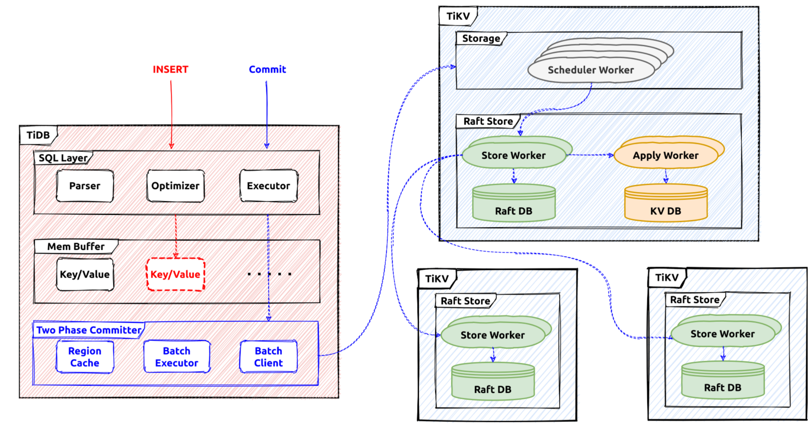

# Transaction

The transaction engine in TiDB is responsible to provide the `ACID` guarantee for all the read and write requests. It's consisted of the client/coordinator part in `tidb` repository and the server/participant part in `tikv` repository. This document is mainly about the `tidb` part.

# The Architecture

In `TiDB` the transaction write flow is like this:



After the transaction is started in a session, all the reads and writes will use a snapshot to fetch data, and the write content will be buffered in the memory buffer
of the transaction. When the `commit` statement is received from the client, the `percolator` protocol will be used to persist these changes to the storage system.

# The Interface

In `tidb`, the [Transaction](https://github.com/pingcap/tidb/blob/master/kv/kv.go#L181) interface defines the commonly used transaction operations.
```
type Transaction interface {
  ...
	// Commit commits the transaction operations to KV store.
	Commit(context.Context) error
	// Rollback undoes the transaction operations to KV store.
	Rollback() error
	// LockKeys tries to lock the entries with the keys in KV store.
	// Will block until all keys are locked successfully or an error occurs.
	LockKeys(ctx context.Context, lockCtx *LockCtx, keys ...Key) error
	// SetOption sets an option with a value, when val is nil, uses the default
	// value of this option.
	SetOption(opt int, val interface{})
	// GetOption returns the option
	GetOption(opt int) interface{}
	...
	// StartTS returns the transaction start timestamp.
	StartTS() uint64
	// Valid returns if the transaction is valid.
	// A transaction become invalid after commit or rollback.
	Valid() bool
	// GetMemBuffer return the MemBuffer binding to this transaction.
	GetMemBuffer() MemBuffer
	// GetSnapshot returns the Snapshot binding to this transaction.
	GetSnapshot() Snapshot
  ...
}
```

[LazyTxn](https://github.com/pingcap/tidb/blob/master/session/txn.go#L50) is a wrapper of the transaction implementations, when the SQL statements are executed in a session context, `LazyTxn` will be used to do things like：
- Return the memory buffer for write.
- Set specific operations or flags for the current transaction.
- Return the snapshot of this transaction.
- etc...

## The Statement Execution

Usually the first thing that will be done executing a statment is to `activiate` the related transaction in its session. By default `TiDB` proviedes the snapshot isolation level so in each new transction, a new global strong snapshot will be fetched first before executing statements. In `tidb` the snapshot is repsented by a global tso which is fetched from the `pd` server, and it acts as the unique idetifier for this transaction. After this operation a transaction is regarded as `activated`.

SQL statement writes will write data into the transaction memory buffer temporarily until the `commit` operations is triggered. There are 3 main interfaces which will write query data into the memory buffer, they are the [tables](https://github.com/pingcap/tidb/blob/master/table/table.go#L166) API:
```
// Table is used to retrieve and modify rows in table.
type Table interface {
	...
	// AddRecord inserts a row which should contain only public columns
	AddRecord(ctx sessionctx.Context, r []types.Datum, opts ...AddRecordOption) (recordID kv.Handle, err error)

	// UpdateRecord updates a row which should contain only writable columns.
	UpdateRecord(ctx context.Context, sctx sessionctx.Context, h kv.Handle, currData, newData []types.Datum, touched []bool) error

	// RemoveRecord removes a row in the table.
	RemoveRecord(ctx sessionctx.Context, h kv.Handle, r []types.Datum) error
	...
}
```

Every statement will use a `staging buffer` during its execution, if it's successful the staging content will be merged into the transaction memory buffer. For example `AddRecord` will try to write an row into the current statement staging buffer, and the `RemoveRecord` will try to remove an row in the staging statement buffer.

## 
