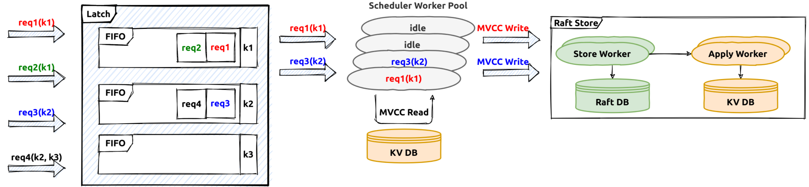

# Transaction In TiKV

The previous [document](./transaction.md) introduces the architecture of the transaction engine and some implementation details in the `TiDB` part. This document is mainly about the `TiKV` part.

As described in the previous docuemnt, the distributed transaction coordinator the `tidb-server` which process the user `COMMIT` query, and the participants are invovled `tikv-servers`.

# Transactional Protocol

Based on the percolator model, the mainly RPC interfaces used in TiDB are described in proto [file](https://github.com/pingcap/kvproto/blob/0f5764a128ad77ccf0a5b0ce0d6e2bfa50a108ce/proto/kvrpcpb.proto#L77). These interfaces will be used by the transaction coordinator to drive the whole transaction commit processing, for example `Prewrite` will be used to write the lock record in TiKV:
```
message PrewriteRequest {
    Context context = 1;
    // The data to be written to the database.
    repeated Mutation mutations = 2;
    // The client picks one key to be primary (unrelated to the primary key concept in SQL). This
    // key's lock is the source of truth for the state of a transaction. All other locks due to a
    // transaction will point to the primary lock.
    bytes primary_lock = 3;
    // Identifies the transaction being written.
    uint64 start_version = 4;
    uint64 lock_ttl = 5;
    // TiKV can skip some checks, used for speeding up data migration.
    bool skip_constraint_check = 6;
    // For pessimistic transaction, some mutations don't need to be locked, for example, non-unique index key.
    repeated bool is_pessimistic_lock = 7;
    // How many keys this transaction involves in this region.
    uint64 txn_size = 8;
    // For pessimistic transactions only; used to check if a conflict lock is already committed.
    uint64 for_update_ts = 9;
    // If min_commit_ts > 0, this is a large transaction request, the final commit_ts
    // will be inferred from `min_commit_ts`.
    uint64 min_commit_ts = 10;
    // When async commit is enabled, `secondaries` should be set as the key list of all secondary
    // locks if the request prewrites the primary lock.
    bool use_async_commit = 11;
    repeated bytes secondaries = 12;
    // When the transaction involves only one region, it's possible to commit the transaction
    // directly with 1PC protocol.
    bool try_one_pc = 13;
    // The max commit ts is reserved for limiting the commit ts of 1PC or async commit, which can be used to avoid
    // inconsistency with schema change.
    uint64 max_commit_ts = 14;
}
```

The `mutations` are changes made by the transaction, `start_version` is the transaction identifier fetched from PD, `for_update_ts` is used by the pessimistic transactions which will be introduced seperately. The `try_one_pc` field is about committing the transaction using `one-phase` protocol, the `use_async_commit` and `secondaries` will be used if the transaction is committing in the `async-commit` mode, these optimizations will be introduced seperately in other documents.

Besides `prewrite` request, there are some other important request types such as `commit` [request](https://github.com/pingcap/kvproto/blob/0f5764a128ad77ccf0a5b0ce0d6e2bfa50a108ce/proto/kvrpcpb.proto#L268) which is used to commit a key and `pessimistic_lock` [request](https://github.com/pingcap/kvproto/blob/0f5764a128ad77ccf0a5b0ce0d6e2bfa50a108ce/proto/kvrpcpb.proto#L125) is used to lock a key.
The `resolve` (request)[https://github.com/pingcap/kvproto/blob/0f5764a128ad77ccf0a5b0ce0d6e2bfa50a108ce/proto/kvrpcpb.proto#L374] will be used to help doing the transaction crash recovery, it will also be introduced in another document.

# Transaction Scheduler



The receiving input transaction requests will be translated into transaction [commands](https://github.com/tikv/tikv/blob/6be3893f7f787b04bf34d99d1369092404ab5cfc/src/storage/txn/commands/mod.rs#L114). Then the transaction [scheduler](https://github.com/tikv/tikv/blob/6be3893f7f787b04bf34d99d1369092404ab5cfc/src/storage/txn/scheduler.rs#L286) will handle these transaction commands, it will first try to fetch the needed key [latches](https://github.com/tikv/tikv/blob/6be3893f7f787b04bf34d99d1369092404ab5cfc/src/storage/txn/latch.rs#L22) (latch is used to sequence all the transaction commands on the same key)，then try to fetch a storage [snapshot](https://github.com/tikv/tikv/blob/6be3893f7f787b04bf34d99d1369092404ab5cfc/components/tikv_kv/src/lib.rs#L191) for the current transaction.

The future processing is done in the transaction scheduler thread-pool, usually there will be some tasks like conflict and constraint checks, write mutation generations. 

# Transaction Log Replication

In TiDB the key space is splitted into different ranges or regions, each region is a raft group and its leader will be responsible for handling its key range related read/write requests. After the transaction command processing, the generated transaction writes will be written into the raft log engine by the region leaders in `raftStore`(raftStore will be introduced in other documents in details). The work flow is like this:


The writes generated by transaction commands will be sent to the raft peer message queue first, the raft batch system will polling each raft peer and handle these requests in the raft thread-pool. After the raft logs are persisted on majority raft group members, they are regarded as `commit`. Then the correspond task be delivered to the apply worker pool to apply the actual write contents to the storage engine, after that the transaction command processing is considered successful and the callback will be invoked to response to the RPC client.


# Transaction Record In TiKV

In TiDB a transaction is considered committed only if its primary key lock is committed succesfully(If async commit protocol is not used). The acutal key and value written into storage engine is in the following format:


| CF	| RocksDB Key |	RocksDB Value |
| ---   | --- | --- |
|Lock	 |user_key	 | lock_info |
|Default |{user_key}{start_ts}	| user_value |
|Write	 |{user_key}{commit_ts}	| write_info |

After `prewrite`, the lock correspond records for the transaction will be written into the storage. Read and write conflicts on the "locked" key will need to consider if it's safe to bypass the lock or it must try to resolve the encountered locks. As `commit_ts` is part of the stored key, there could be different historical versions for it, and GC is responsible to clean up all the old versions which will not be needed, GC will be introduced in another document.
